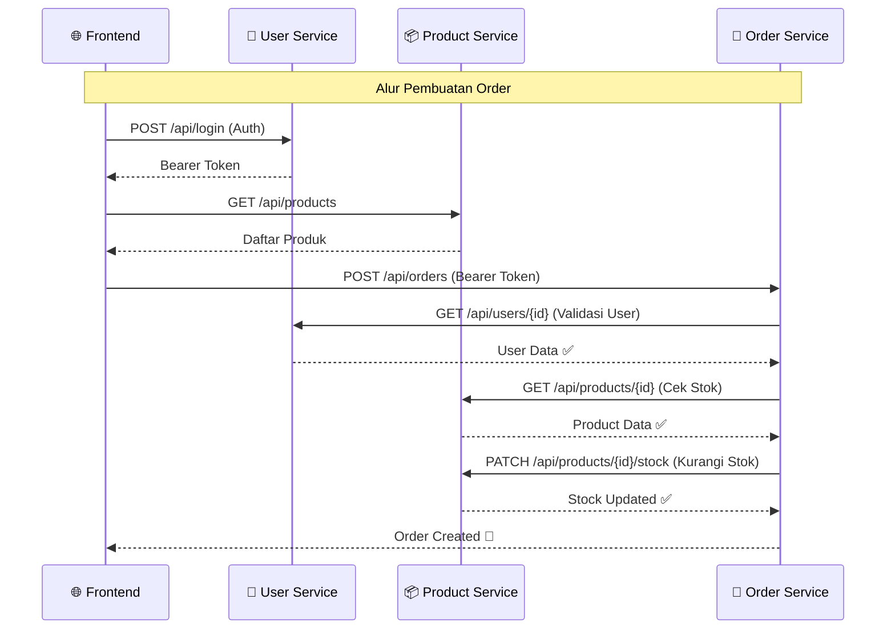

<div align="center">

# 🏗️ E-Commerce Microservices Architecture

### Enterprise Application Integration — Service-to-Service Communication

[](https://laravel.com)
[](https://nodejs.org)
[](https://reactjs.org)
[](https://www.docker.com)

[](https://www.mysql.com)
[](https://www.postgresql.org)
[](https://vitejs.dev)
[](https://tailwindcss.com)

<br/>


> **Proyek UTS Mata Kuliah EAI** — Implementasi arsitektur microservices dengan pola *Service-to-Service Communication* menggunakan REST API. Setiap service berdiri sendiri dengan database masing-masing dan berkomunikasi melalui HTTP internal.

<br/>

[📖 Dokumentasi](#-arsitektur-sistem) · [🚀 Quick Start](#-quick-start) · [📡 API Reference](#-api-endpoints) · [🧪 Testing](#-testing)

---

</div>

## 📋 Daftar Isi

- [Arsitektur Sistem](#-arsitektur-sistem)
- [Tech Stack](#-tech-stack)
- [Struktur Proyek](#-struktur-proyek)
- [Quick Start](#-quick-start)
- [Service Details](#-service-details)
- [API Endpoints](#-api-endpoints)
- [Testing](#-testing)
- [Screenshots](#-screenshots)
- [Kontributor](#-kontributor)

---

## 🏛️ Arsitektur Sistem

```
┌─────────────────────────────────────────────────────────────────────┐
│                        🌐 Frontend (React + Vite)                  │
│                          localhost:5173                              │
└──────────┬──────────────────┬──────────────────┬────────────────────┘
           │                  │                  │
           ▼                  ▼                  ▼
┌──────────────────┐ ┌──────────────────┐ ┌──────────────────┐
│  👤 User Service │ │ 📦 Product Svc   │ │  🛒 Order Service│
│  Laravel 12      │ │ Laravel 12       │ │  Node.js/Express │
│  Port: 8000      │ │ Port: 8001       │ │  Port: 8002      │
│                  │ │                  │ │                  │
│  • Auth (Sanctum)│ │  • CRUD Products │ │  • Create Order  │
│  • User CRUD     │ │  • Categories    │ │  • Order History │
│  • Role: Admin/  │ │  • Stock Mgmt    │ │  • Status Update │
│    Buyer         │ │                  │ │  • Cancel Order  │
└────────┬─────────┘ └────────┬─────────┘ └──┬──────────┬────┘
         │                    │               │          │
         │                    │          ◄────┘          │
         │                    │    Fetch User            │
         │                    │◄─────────────────────────┘
         │                    │    Fetch Product & Stock
         ▼                    ▼
┌──────────────────┐ ┌──────────────────┐
│   🐬 MySQL 8.0   │ │  🐘 PostgreSQL 15│
│                  │ │                  │
│  • db_user_svc   │ │  • db_order_svc  │
│  • db_product_svc│ │                  │
└──────────────────┘ └──────────────────┘
```

### 🔄 Alur Komunikasi Service-to-Service



---

## 🛠️ Tech Stack

<div align="center">

| Layer | Teknologi | Versi |
|:---:|:---:|:---:|
| **Frontend** | React + Vite + TailwindCSS | 18 / 5 / 3.4 |
| **User Service** | Laravel + Sanctum | 12 / 4.0 |
| **Product Service** | Laravel | 12 |
| **Order Service** | Node.js + Express + Sequelize | 22 / 5 / 6 |
| **Database** | MySQL + PostgreSQL | 8.0 / 15 |
| **Container** | Docker Compose | Latest |
| **State Mgmt** | Zustand | 4.5 |
| **HTTP Client** | Axios | 1.6+ |

</div>

---

## 📁 Struktur Proyek

```
EAI-UTS-ServiceToService/
│
├── 🐳 docker-compose.yml          # Orchestration semua service
├── 🗄️ init-mysql.sql               # Init script untuk multiple DB
│
├── 🌐 frontend-react/              # React SPA (Vite + Tailwind)
│   ├── src/
│   │   ├── Pages/                  # Login, Register, Products, Cart,
│   │   │                           # Checkout, Orders, ProductDetail
│   │   ├── components/             # Reusable UI components
│   │   ├── context/                # Auth context
│   │   └── services/               # Axios API services
│   └── Dockerfile
│
├── 👤 service-user-laravel/         # User & Auth Service
│   ├── app/Http/Controllers/Api/   # AuthController, UserController
│   ├── database/seeders/           # Admin & Buyer seeder
│   ├── routes/api.php              # Auth + CRUD routes
│   └── Dockerfile
│
├── 📦 service-product-laravel/      # Product & Category Service
│   ├── app/Http/Controllers/Api/   # ProductController, CategoryController
│   ├── routes/api.php              # Product + Category CRUD
│   └── Dockerfile
│
└── 🛒 service-order-node/           # Order & Transaction Service
    ├── controllers/                # OrderController
    ├── models/                     # Order, OrderItem (Sequelize)
    ├── middleware/                  # Auth middleware (Bearer token)
    ├── routes/api.js               # Order routes
    └── Dockerfile
```

---

## 🚀 Quick Start

### Prerequisites

- [Docker](https://www.docker.com/get-started) & Docker Compose
- [Git](https://git-scm.com/)

### 1️⃣ Clone Repository

```bash
git clone https://github.com/bagusardin25/EAI-UTS-ServiceToService.git
cd EAI-UTS-ServiceToService
```

### 2️⃣ Jalankan Semua Service

```bash
docker compose up --build -d
```

> ⏳ Tunggu hingga semua container berjalan. Health check akan memastikan database siap sebelum service dimulai.

### 3️⃣ Migrasi & Seeding Database

```bash
# User Service — Migrasi & Seed
docker exec eai-service-user php artisan migrate --force
docker exec eai-service-user php artisan db:seed --force

# Product Service — Migrasi & Seed
docker exec eai-service-product php artisan migrate --force
docker exec eai-service-product php artisan db:seed --force
```

### 4️⃣ Akses Aplikasi

| Service | URL | Keterangan |
|:---|:---|:---|
| 🌐 **Frontend** | [http://localhost:5173](http://localhost:5173) | React SPA |
| 👤 **User Service** | [http://localhost:8000/api](http://localhost:8000/api) | Laravel REST API |
| 📦 **Product Service** | [http://localhost:8001/api](http://localhost:8001/api) | Laravel REST API |
| 🛒 **Order Service** | [http://localhost:8002/api](http://localhost:8002/api) | Express REST API |

### 🔑 Default Credentials

| Role | Email | Password |
|:---|:---|:---|
| **Admin** | `admin@example.com` | `password` |
| **Buyer** | `buyer@example.com` | `password` |

---

## 📡 API Endpoints

### 👤 User Service — `localhost:8000`

<details>
<summary><b>🔓 Authentication</b></summary>

| Method | Endpoint | Deskripsi | Auth |
|:---:|:---|:---|:---:|
| `POST` | `/api/register` | Registrasi user baru | ❌ |
| `POST` | `/api/login` | Login & dapatkan token | ❌ |
| `POST` | `/api/logout` | Logout & revoke token | 🔐 |

</details>

<details>
<summary><b>👥 User Management (Admin Only)</b></summary>

| Method | Endpoint | Deskripsi | Auth |
|:---:|:---|:---|:---:|
| `GET` | `/api/users` | Semua users | 🔐 Admin |
| `POST` | `/api/users` | Buat user baru | 🔐 Admin |
| `GET` | `/api/users/{id}` | Detail user | 🔐 Admin |
| `PUT` | `/api/users/{id}` | Update user | 🔐 Admin |
| `DELETE` | `/api/users/{id}` | Hapus user | 🔐 Admin |
| `GET` | `/api/users/{id}/orders` | Orders milik user | 🔐 Admin |

</details>

<details>
<summary><b>👤 Profile</b></summary>

| Method | Endpoint | Deskripsi | Auth |
|:---:|:---|:---|:---:|
| `GET` | `/api/auth/profile` | Lihat profil sendiri | 🔐 |
| `PUT` | `/api/auth/profile` | Update profil sendiri | 🔐 |

</details>

---

### 📦 Product Service — `localhost:8001`

<details>
<summary><b>🛍️ Products</b></summary>

| Method | Endpoint | Deskripsi | Auth |
|:---:|:---|:---|:---:|
| `GET` | `/api/products` | Semua produk | ❌ |
| `POST` | `/api/products` | Buat produk | ❌ |
| `GET` | `/api/products/{id}` | Detail produk | ❌ |
| `PUT` | `/api/products/{id}` | Update produk | ❌ |
| `DELETE` | `/api/products/{id}` | Hapus produk | ❌ |
| `PATCH` | `/api/products/{id}/stock` | Update stok | ❌ |

</details>

<details>
<summary><b>🏷️ Categories</b></summary>

| Method | Endpoint | Deskripsi | Auth |
|:---:|:---|:---|:---:|
| `GET` | `/api/categories` | Semua kategori | ❌ |
| `POST` | `/api/categories` | Buat kategori | ❌ |
| `GET` | `/api/categories/{id}` | Detail kategori | ❌ |
| `PUT` | `/api/categories/{id}` | Update kategori | ❌ |
| `DELETE` | `/api/categories/{id}` | Hapus kategori | ❌ |

</details>

---

### 🛒 Order Service — `localhost:8002`

<details>
<summary><b>📋 Orders</b></summary>

| Method | Endpoint | Deskripsi | Auth |
|:---:|:---|:---|:---:|
| `POST` | `/api/orders` | Buat order baru | 🔐 |
| `GET` | `/api/orders` | Orders milik user login | 🔐 |
| `GET` | `/api/orders/all` | Semua orders (Admin) | 🔐 |
| `GET` | `/api/orders/:id` | Detail order | 🔐 |
| `GET` | `/api/orders/user/:userId` | Orders by user ID | 🔐 |
| `PUT` | `/api/orders/:id/status` | Update status order | 🔐 |
| `PATCH` | `/api/orders/:id/cancel` | Cancel order | 🔐 |

</details>

---

## 🧪 Testing

### Menggunakan Postman

Import collection Postman dan set environment variables:

```
{{user_service}}    = http://localhost:8000
{{product_service}} = http://localhost:8001
{{order_service}}   = http://localhost:8002
```

### Alur Testing yang Disarankan

```
1. 🔑 Login sebagai Admin     → POST {{user_service}}/api/login
2. 📦 Buat Produk             → POST {{product_service}}/api/products
3. 🔑 Login sebagai Buyer     → POST {{user_service}}/api/login
4. 🛒 Buat Order              → POST {{order_service}}/api/orders
5. 📋 Cek Order History       → GET  {{order_service}}/api/orders
6. ✅ Update Status (Admin)   → PUT  {{order_service}}/api/orders/:id/status
7. ❌ Cancel Order (Buyer)    → PATCH {{order_service}}/api/orders/:id/cancel
```

---

## 🐳 Docker Commands

```bash
# Jalankan semua service
docker compose up --build -d

# Lihat status containers
docker compose ps

# Lihat logs service tertentu
docker compose logs -f service-order

# Stop semua service
docker compose down

# Stop dan hapus volumes (reset database)
docker compose down -v
```

---

## ✨ Fitur Utama

<div align="center">

| Fitur | Deskripsi |
|:---:|:---|
| 🔐 **Authentication** | JWT via Laravel Sanctum dengan role-based access (Admin/Buyer) |
| 🏪 **Product Management** | CRUD produk dengan kategori dan manajemen stok otomatis |
| 🛒 **Order Processing** | Pembuatan order dengan validasi user & stok secara cross-service |
| 📊 **Order Tracking** | Tracking status order: Pending → Processing → Shipped → Delivered |
| 🔄 **Service Communication** | REST API internal antar service menggunakan Axios/HTTP Client |
| 🐳 **Containerized** | Fully Dockerized dengan health checks dan auto-restart |
| 🎨 **Modern Frontend** | React 18 + Tailwind CSS dengan state management Zustand |
| 📱 **Responsive UI** | Interface yang responsif untuk desktop dan mobile |

</div>

---

## 📸 Screenshots

> 🚧 *Coming soon — jalankan `docker compose up --build -d` untuk melihat live demo.*

<!-- 
Tambahkan screenshot di sini:


-->

---

## 👥 Kontributor

<div align="center">

| Kontributor |
|:---:|
| **Bagus Ardin** |
| [](https://github.com/bagusardin25) |

</div>

---

<div align="center">

### 📄 Lisensi

Proyek ini dibuat untuk keperluan **UTS Mata Kuliah Enterprise Application Integration (EAI)**.

<br/>

⭐ **Jika proyek ini membantu, berikan bintang!** ⭐

<br/>

<sub>Made with ❤️ using Laravel, Node.js, React & Docker</sub>

</div>
