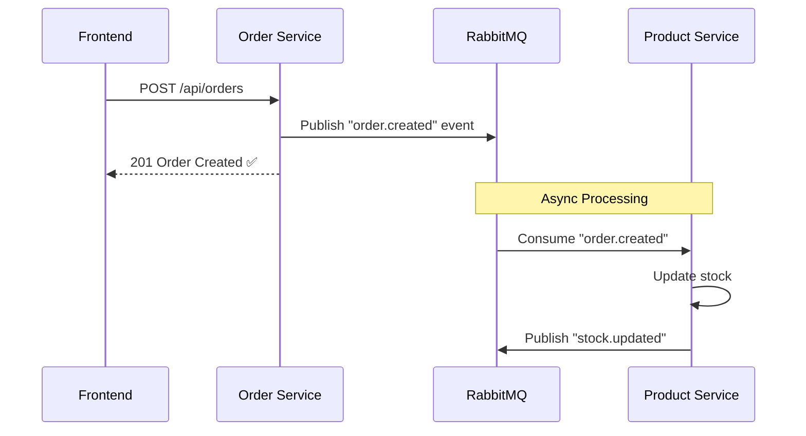

# 🐰 Implementasi Async Communication dengan RabbitMQ

## 📋 Daftar Isi
- [Arsitektur](#-arsitektur)
- [Perubahan Docker Compose](#-perubahan-docker-compose)
- [Implementasi Laravel Services](#-implementasi-laravel-services)
- [Implementasi Node.js Service](#-implementasi-nodejs-service)
- [Testing](#-testing)

---

## 🏗️ Arsitektur

### Sebelum (Synchronous)
```
Order Service → HTTP Request → Product Service (update stock)
     ↓ (wait)
   Response
```

### Sesudah (Asynchronous)
```
Order Service → Publish Event → RabbitMQ Queue → Consumer (Product Service)
     ↓ (immediate)
   Response (order created)
```

### Event Flow


---

## 🐳 Perubahan Docker Compose

### 1. Tambahkan RabbitMQ Service

Edit `docker-compose.yml`, tambahkan service RabbitMQ setelah database services:

```yaml
  # ============================================================
  # MESSAGE BROKER
  # ============================================================

  rabbitmq:
    image: rabbitmq:3.13-management-alpine
    container_name: eai-rabbitmq
    restart: unless-stopped
    ports:
      - "5672:5672"    # AMQP port
      - "15672:15672"  # Management UI
    environment:
      RABBITMQ_DEFAULT_USER: admin
      RABBITMQ_DEFAULT_PASS: admin123
    volumes:
      - rabbitmq_data:/var/lib/rabbitmq
    networks:
      - microservices-net
    healthcheck:
      test: ["CMD", "rabbitmq-diagnostics", "ping"]
      interval: 10s
      timeout: 5s
      retries: 5
```

### 2. Update Service Dependencies

Tambahkan RabbitMQ sebagai dependency di semua backend services:

```yaml
  service-user:
    # ... existing config ...
    environment:
      # ... existing env ...
      RABBITMQ_HOST: rabbitmq
      RABBITMQ_PORT: 5672
      RABBITMQ_USER: admin
      RABBITMQ_PASSWORD: admin123
    depends_on:
      mysql:
        condition: service_healthy
      rabbitmq:
        condition: service_healthy

  service-product:
    # ... existing config ...
    environment:
      # ... existing env ...
      RABBITMQ_HOST: rabbitmq
      RABBITMQ_PORT: 5672
      RABBITMQ_USER: admin
      RABBITMQ_PASSWORD: admin123
    depends_on:
      mysql:
        condition: service_healthy
      rabbitmq:
        condition: service_healthy

  service-order:
    # ... existing config ...
    environment:
      # ... existing env ...
      RABBITMQ_HOST: rabbitmq
      RABBITMQ_PORT: 5672
      RABBITMQ_USER: admin
      RABBITMQ_PASSWORD: admin123
    depends_on:
      postgres:
        condition: service_healthy
      rabbitmq:
        condition: service_healthy
```

### 3. Tambahkan Volume

Di bagian volumes, tambahkan:

```yaml
volumes:
  mysql_data:
    driver: local
  postgres_data:
    driver: local
  rabbitmq_data:
    driver: local
```

---

## 📦 Implementasi Laravel Services

### 1. Install Dependencies

Masuk ke container Laravel dan install package:

```bash
docker exec -it eai-service-product bash
composer require php-amqplib/php-amqplib
exit

docker exec -it eai-service-user bash
composer require php-amqplib/php-amqplib
exit
```

### 2. Konfigurasi Queue Connection

Edit `service-product-laravel/config/queue.php`, tambahkan connection RabbitMQ:

```php
'connections' => [
    // ... existing connections ...

    'rabbitmq' => [
        'driver' => 'rabbitmq',
        'host' => env('RABBITMQ_HOST', 'localhost'),
        'port' => env('RABBITMQ_PORT', 5672),
        'user' => env('RABBITMQ_USER', 'guest'),
        'password' => env('RABBITMQ_PASSWORD', 'guest'),
        'vhost' => env('RABBITMQ_VHOST', '/'),
        'queue' => env('RABBITMQ_QUEUE', 'default'),
        'exchange' => env('RABBITMQ_EXCHANGE', 'amq.direct'),
        'exchange_type' => env('RABBITMQ_EXCHANGE_TYPE', 'direct'),
    ],
],
```

### 3. Update .env.docker

Edit `service-product-laravel/.env.docker`:

```env
QUEUE_CONNECTION=rabbitmq

RABBITMQ_HOST=rabbitmq
RABBITMQ_PORT=5672
RABBITMQ_USER=admin
RABBITMQ_PASSWORD=admin123
RABBITMQ_VHOST=/
RABBITMQ_QUEUE=product_queue
RABBITMQ_EXCHANGE=eai_exchange
RABBITMQ_EXCHANGE_TYPE=topic
```

Lakukan hal yang sama untuk `service-user-laravel/.env.docker`.

### 4. Buat RabbitMQ Service Class

Buat file `service-product-laravel/app/Services/RabbitMQService.php`:

```php
<?php

namespace App\Services;

use PhpAmqpLib\Connection\AMQPStreamConnection;
use PhpAmqpLib\Message\AMQPMessage;
use Illuminate\Support\Facades\Log;

class RabbitMQService
{
    private $connection;
    private $channel;

    public function __construct()
    {
        $this->connection = new AMQPStreamConnection(
            config('queue.connections.rabbitmq.host'),
            config('queue.connections.rabbitmq.port'),
            config('queue.connections.rabbitmq.user'),
            config('queue.connections.rabbitmq.password'),
            config('queue.connections.rabbitmq.vhost')
        );
        $this->channel = $this->connection->channel();
    }

    public function publish(string $exchange, string $routingKey, array $data): void
    {
        $this->channel->exchange_declare($exchange, 'topic', false, true, false);
        
        $message = new AMQPMessage(
            json_encode($data),
            ['content_type' => 'application/json', 'delivery_mode' => AMQPMessage::DELIVERY_MODE_PERSISTENT]
        );

        $this->channel->basic_publish($message, $exchange, $routingKey);
        
        Log::info("Published to RabbitMQ", [
            'exchange' => $exchange,
            'routing_key' => $routingKey,
            'data' => $data
        ]);
    }

    public function consume(string $queue, string $exchange, string $routingKey, callable $callback): void
    {
        $this->channel->exchange_declare($exchange, 'topic', false, true, false);
        $this->channel->queue_declare($queue, false, true, false, false);
        $this->channel->queue_bind($queue, $exchange, $routingKey);

        $this->channel->basic_consume($queue, '', false, false, false, false, $callback);

        Log::info("Waiting for messages on queue: {$queue}");

        while ($this->channel->is_consuming()) {
            $this->channel->wait();
        }
    }

    public function __destruct()
    {
        $this->channel->close();
        $this->connection->close();
    }
}
```

### 5. Buat Consumer Command (Product Service)

Buat file `service-product-laravel/app/Console/Commands/ConsumeOrderEvents.php`:

```php
<?php

namespace App\Console\Commands;

use Illuminate\Console\Command;
use App\Services\RabbitMQService;
use App\Models\Product;
use Illuminate\Support\Facades\Log;
use PhpAmqpLib\Message\AMQPMessage;

class ConsumeOrderEvents extends Command
{
    protected $signature = 'rabbitmq:consume-orders';
    protected $description = 'Consume order events from RabbitMQ';

    public function handle()
    {
        $rabbitmq = new RabbitMQService();

        $callback = function (AMQPMessage $msg) {
            $data = json_decode($msg->body, true);
            
            Log::info('Received order event', $data);
            $this->info("Processing order: {$data['order_id']}");

            try {
                // Update stock untuk setiap item
                foreach ($data['items'] as $item) {
                    $product = Product::find($item['product_id']);
                    
                    if ($product) {
                        $product->stock -= $item['quantity'];
                        $product->save();
                        
                        $this->info("Updated stock for product {$product->id}: {$product->stock}");
                    }
                }

                // Publish event stock updated
                $rabbitmq->publish(
                    'eai_exchange',
                    'stock.updated',
                    [
                        'order_id' => $data['order_id'],
                        'status' => 'success',
                        'timestamp' => now()->toIso8601String()
                    ]
                );

                $msg->ack();
                $this->info("Order {$data['order_id']} processed successfully");
                
            } catch (\Exception $e) {
                Log::error('Failed to process order', [
                    'error' => $e->getMessage(),
                    'order_id' => $data['order_id']
                ]);
                
                $msg->nack(true); // Requeue message
            }
        };

        $rabbitmq->consume('product_queue', 'eai_exchange', 'order.created', $callback);
    }
}
```

### 6. Update Dockerfile (Product Service)

Edit `service-product-laravel/Dockerfile`, tambahkan supervisor untuk menjalankan consumer:

```dockerfile
FROM php:8.3-fpm

# Install dependencies
RUN apt-get update && apt-get install -y \
    git \
    curl \
    libpng-dev \
    libonig-dev \
    libxml2-dev \
    zip \
    unzip \
    supervisor

# Install PHP extensions
RUN docker-php-ext-install pdo_mysql mbstring exif pcntl bcmath gd sockets

# Install Composer
COPY --from=composer:latest /usr/bin/composer /usr/bin/composer

WORKDIR /var/www

COPY . .

RUN composer install --no-dev --optimize-autoloader

# Supervisor config
RUN echo "[program:rabbitmq-consumer]\n\
command=php /var/www/artisan rabbitmq:consume-orders\n\
autostart=true\n\
autorestart=true\n\
stderr_logfile=/var/log/rabbitmq-consumer.err.log\n\
stdout_logfile=/var/log/rabbitmq-consumer.out.log" > /etc/supervisor/conf.d/rabbitmq-consumer.conf

EXPOSE 8001

CMD php artisan config:cache && \
    php artisan route:cache && \
    supervisord -c /etc/supervisor/supervisord.conf && \
    php artisan serve --host=0.0.0.0 --port=8001
```

---

## 🟢 Implementasi Node.js Service

### 1. Install Dependencies

Edit `service-order-node/package.json`, tambahkan:

```json
{
  "dependencies": {
    "amqplib": "^0.10.4",
    // ... existing dependencies
  }
}
```

### 2. Buat RabbitMQ Service

Buat file `service-order-node/services/rabbitmq.js`:

```javascript
const amqp = require('amqplib');

class RabbitMQService {
  constructor() {
    this.connection = null;
    this.channel = null;
  }

  async connect() {
    try {
      this.connection = await amqp.connect({
        protocol: 'amqp',
        hostname: process.env.RABBITMQ_HOST || 'localhost',
        port: process.env.RABBITMQ_PORT || 5672,
        username: process.env.RABBITMQ_USER || 'guest',
        password: process.env.RABBITMQ_PASSWORD || 'guest',
        vhost: process.env.RABBITMQ_VHOST || '/'
      });

      this.channel = await this.connection.createChannel();
      console.log('✅ Connected to RabbitMQ');
    } catch (error) {
      console.error('❌ RabbitMQ connection failed:', error);
      throw error;
    }
  }

  async publish(exchange, routingKey, data) {
    try {
      await this.channel.assertExchange(exchange, 'topic', { durable: true });
      
      const message = Buffer.from(JSON.stringify(data));
      this.channel.publish(exchange, routingKey, message, {
        persistent: true,
        contentType: 'application/json'
      });

      console.log(`📤 Published to ${exchange}/${routingKey}:`, data);
    } catch (error) {
      console.error('Failed to publish message:', error);
      throw error;
    }
  }

  async consume(queue, exchange, routingKey, callback) {
    try {
      await this.channel.assertExchange(exchange, 'topic', { durable: true });
      await this.channel.assertQueue(queue, { durable: true });
      await this.channel.bindQueue(queue, exchange, routingKey);

      console.log(`📥 Waiting for messages on ${queue}...`);

      this.channel.consume(queue, async (msg) => {
        if (msg) {
          const data = JSON.parse(msg.content.toString());
          console.log('Received:', data);

          try {
            await callback(data);
            this.channel.ack(msg);
          } catch (error) {
            console.error('Error processing message:', error);
            this.channel.nack(msg, false, true); // Requeue
          }
        }
      });
    } catch (error) {
      console.error('Failed to consume messages:', error);
      throw error;
    }
  }

  async close() {
    await this.channel?.close();
    await this.connection?.close();
  }
}

module.exports = new RabbitMQService();
```

### 3. Update Order Controller

Edit `service-order-node/controllers/orderController.js`:

```javascript
const rabbitmq = require('../services/rabbitmq');

// Dalam fungsi createOrder, ganti HTTP call dengan publish event
exports.createOrder = async (req, res) => {
  try {
    const { items } = req.body;
    const userId = req.user.id;

    // Validasi user (tetap sync)
    const userResponse = await axios.get(`${USER_SERVICE_URL}/api/users/${userId}`);
    if (!userResponse.data) {
      return res.status(404).json({ message: 'User not found' });
    }

    // Validasi product & hitung total (tetap sync untuk validasi)
    let totalAmount = 0;
    const validatedItems = [];

    for (const item of items) {
      const productResponse = await axios.get(
        `${PRODUCT_SERVICE_URL}/api/products/${item.product_id}`
      );
      const product = productResponse.data.data;

      if (product.stock < item.quantity) {
        return res.status(400).json({
          message: `Insufficient stock for product ${product.name}`
        });
      }

      totalAmount += product.price * item.quantity;
      validatedItems.push({
        product_id: product.id,
        quantity: item.quantity,
        price: product.price
      });
    }

    // Buat order
    const order = await Order.create({
      user_id: userId,
      total_amount: totalAmount,
      status: 'pending'
    });

    // Buat order items
    for (const item of validatedItems) {
      await OrderItem.create({
        order_id: order.id,
        ...item
      });
    }

    // 🔥 PUBLISH EVENT KE RABBITMQ (ASYNC)
    await rabbitmq.publish('eai_exchange', 'order.created', {
      order_id: order.id,
      user_id: userId,
      items: validatedItems,
      total_amount: totalAmount,
      timestamp: new Date().toISOString()
    });

    res.status(201).json({
      message: 'Order created successfully',
      data: order
    });

  } catch (error) {
    console.error('Create order error:', error);
    res.status(500).json({ message: 'Failed to create order' });
  }
};
```

### 4. Buat Consumer untuk Stock Updated Event

Buat file `service-order-node/consumers/stockConsumer.js`:

```javascript
const rabbitmq = require('../services/rabbitmq');
const { Order } = require('../models');

async function startStockConsumer() {
  await rabbitmq.connect();

  await rabbitmq.consume(
    'order_queue',
    'eai_exchange',
    'stock.updated',
    async (data) => {
      console.log('Stock updated for order:', data.order_id);

      // Update order status
      const order = await Order.findByPk(data.order_id);
      if (order && data.status === 'success') {
        order.status = 'processing';
        await order.save();
        console.log(`Order ${order.id} status updated to processing`);
      }
    }
  );
}

module.exports = { startStockConsumer };
```

### 5. Update Server Entry Point

Edit `service-order-node/server.js`:

```javascript
const express = require('express');
const rabbitmq = require('./services/rabbitmq');
const { startStockConsumer } = require('./consumers/stockConsumer');

const app = express();

// ... existing middleware & routes ...

// Initialize RabbitMQ
rabbitmq.connect()
  .then(() => {
    console.log('Starting RabbitMQ consumers...');
    startStockConsumer();
  })
  .catch(err => {
    console.error('Failed to start RabbitMQ:', err);
  });

const PORT = process.env.PORT || 8002;
app.listen(PORT, () => {
  console.log(`Order Service running on port ${PORT}`);
});

// Graceful shutdown
process.on('SIGINT', async () => {
  await rabbitmq.close();
  process.exit(0);
});
```

---

## 🧪 Testing

### 1. Rebuild & Start Services

```bash
docker compose down -v
docker compose up --build -d
```

### 2. Cek RabbitMQ Management UI

Buka browser: http://localhost:15672
- Username: `admin`
- Password: `admin123`

### 3. Jalankan Migrasi & Seeding

```bash
docker exec eai-service-user php artisan migrate --force
docker exec eai-service-user php artisan db:seed --force
docker exec eai-service-product php artisan migrate --force
docker exec eai-service-product php artisan db:seed --force
```

### 4. Test Order Creation

```bash
# Login
curl -X POST http://localhost:8000/api/login \
  -H "Content-Type: application/json" \
  -d '{"email":"buyer@example.com","password":"password"}'

# Buat order (akan publish event ke RabbitMQ)
curl -X POST http://localhost:8002/api/orders \
  -H "Authorization: Bearer YOUR_TOKEN" \
  -H "Content-Type: application/json" \
  -d '{
    "items": [
      {"product_id": 1, "quantity": 2}
    ]
  }'
```

### 5. Monitor Logs

```bash
# Order Service (publisher)
docker logs -f eai-service-order

# Product Service (consumer)
docker logs -f eai-service-product
```

### 6. Cek di RabbitMQ UI

- Lihat **Exchanges** → `eai_exchange`
- Lihat **Queues** → `product_queue`, `order_queue`
- Monitor message rate dan consumers

---

## ✅ Verifikasi

Setelah implementasi, sistem akan bekerja seperti ini:

1. ✅ User membuat order → Order Service langsung response 201
2. ✅ Event `order.created` dipublish ke RabbitMQ
3. ✅ Product Service consume event → update stock
4. ✅ Product Service publish `stock.updated`
5. ✅ Order Service consume event → update status order

**Keuntungan:**
- ⚡ Response lebih cepat (tidak menunggu update stock)
- 🔄 Retry otomatis jika gagal
- 📊 Monitoring via RabbitMQ UI
- 🛡️ Fault tolerance (jika Product Service down, message tetap di queue)

---

## 🎯 Next Steps

1. Tambahkan **Dead Letter Queue** untuk handle failed messages
2. Implementasi **Event Sourcing** untuk audit trail
3. Tambahkan **Notification Service** yang consume order events
4. Setup **Prometheus + Grafana** untuk monitoring RabbitMQ metrics
